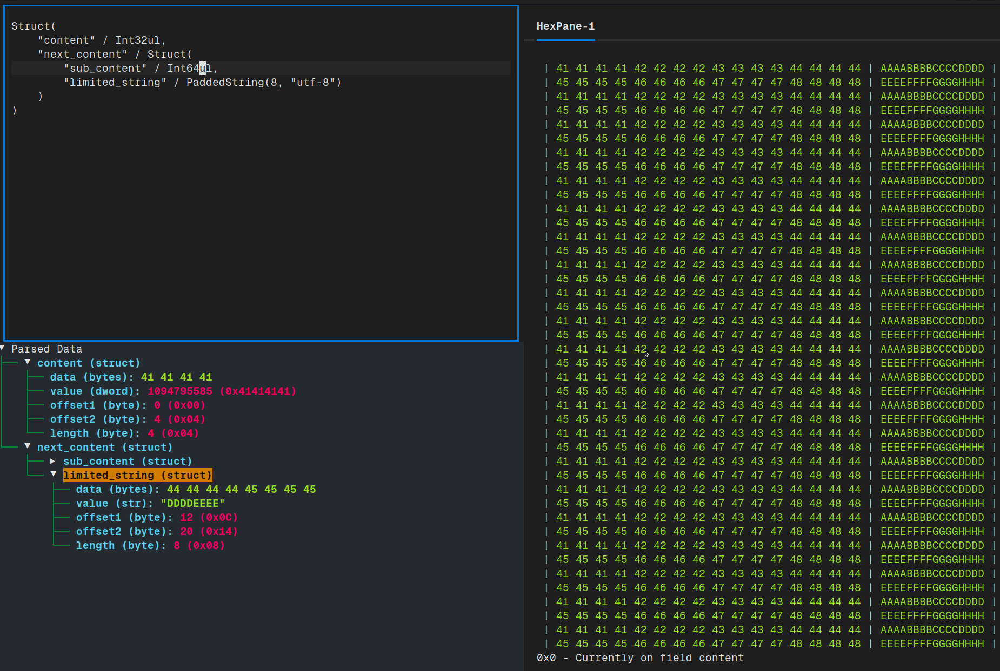

# BinTV - Binary Structure Viewer & Network Packet Analyzer

A powerful TUI (Text User Interface) tool for analyzing binary files and network captures, combining the best features of hex editors, protocol analyzers, and structure viewers.



## Features

### Binary Analysis
- 🔍 **Interactive hex dump** with field highlighting
- 🌳 **Construct-based parsing** with live structure tree
- ✏️ **Edit field values** with type-aware validation  
- 📊 **SVG export** in Corkami poster style
- 🎨 **Color-coded fields** with bezier curve connectors

### PCAP Analysis (NEW!)
- 📦 **PCAP/PCAPNG support** - Load and analyze network captures
- 🔎 **Fuzzy field search** - Find fields across all packets instantly
- 📋 **Packet list view** - Wireshark-like packet browser
- 🏷️ **Protocol dissection** - Automatic parsing of Ethernet, IPv4/IPv6, TCP, UDP, ICMP, ARP, DNS
- 🎯 **Display filters** - Filter packets by protocol, address, or field values
- ⌨️ **Keyboard navigation** - vim-style bindings for fast navigation

## Installation

```bash
# Clone the repository
git clone https://github.com/yourusername/binteractiview.git
cd binteractiview

# Install dependencies
pip install -e .

# Or with optional dependencies
pip install -e ".[full]"
```

## Quick Start

### Binary File Analysis
```bash
# Open a binary file
bintv -t firmware.bin

# The construct editor (left panel) accepts construct library syntax:
# Struct("magic" / Bytes(4), "version" / Int32ul, "data" / GreedyBytes)
```

### PCAP Analysis
```bash
# Open a PCAP file (auto-detected)
bintv -t capture.pcap

# Or force PCAP mode
bintv -p -t network.cap

# Direct PCAP viewer command
bintv-pcap capture.pcapng
```

## Keyboard Shortcuts

### General
| Key | Action |
|-----|--------|
| `Ctrl+O` | Open file |
| `Ctrl+E` | Export SVG |
| `Ctrl+L` | Toggle log panel |
| `Ctrl+Q` | Quit |

### PCAP Mode
| Key | Action |
|-----|--------|
| `/` | Open filter input |
| `Ctrl+F` | Fuzzy search fields |
| `n` / `p` | Next/Previous packet |
| `j` / `k` | Move cursor down/up |
| `g` / `G` | First/Last packet |
| `Enter` | Select packet |
| `Escape` | Clear filter |

### Binary Mode
| Key | Action |
|-----|--------|
| Right-click | Context menu on tree |
| `Ctrl+O` | Load binary file |

## Display Filters (PCAP Mode)

Filter packets using simple expressions:

```
tcp                     # All TCP packets
udp                     # All UDP packets  
192.168.1.1            # Packets with this IP
tcp.port == 80         # TCP port 80
ip.src == 10.0.0.1     # Source IP filter
dns                    # DNS packets
```

## Fuzzy Field Search

Press `Ctrl+F` in PCAP mode to search all packet fields:

- Type partial field names: `tcp.p` → matches `tcp.port`, `tcp.payload`
- Search by layer: `ip` → matches all IP fields
- Search by value: `80` → matches port 80 fields

## Protocol Support

Currently supported protocols:
- **Layer 2**: Ethernet
- **Layer 3**: IPv4, IPv6, ARP
- **Layer 4**: TCP, UDP, ICMP
- **Layer 7**: DNS (basic), HTTP (detection)

## SVG Export

Export beautiful Corkami-style visualizations:

```bash
# In binary mode: Ctrl+E
# In PCAP mode: Ctrl+E (exports current packet)
```

Features:
- Color-coded hex dump with field highlighting
- Bezier curve connectors from hex to field table
- Raw bytes vs. decoded value comparison
- Transformation indicators (⚡) for decoded data

## Architecture

```
bintv/
├── app.py              # Main binary viewer app
├── pcap_app.py         # PCAP viewer app  
├── pcap_parser.py      # PCAP parsing and protocol constructs
├── svg_exporter.py     # Legacy SVG export
├── svg_exporter_v2.py  # Corkami-style SVG export
├── widgets/
│   ├── hex_view.py           # Hex dump widget
│   ├── packet_list.py        # Packet table widget
│   ├── fuzzy_finder.py       # Fuzzy search widget
│   └── reactive_construct_tree.py  # Structure tree widget
```

## Examples

### Analyzing a Firmware Binary
```python
# In the construct editor:
Struct(
    "header" / Struct(
        "magic" / Const(b"FW"),
        "version" / Int16ul,
        "size" / Int32ul,
    ),
    "data" / Bytes(this.header.size),
    "checksum" / Int32ul,
)
```

### Filtering Network Traffic
```bash
# Load PCAP
bintv -t capture.pcap

# Press / and enter filter:
tcp.dst_port == 443    # HTTPS traffic
```

## Field Editing (Binary Mode)

### Edit a Field Value:
1. Right-click on any field in the parsed values tree
2. Select "✏️ Edit Value" from the context menu
3. Supports: integers (decimal/hex), bytes, strings, floats, booleans

### Input Formats:
- **Integers**: `255` or `0xFF`
- **Bytes**: `DEADBEEF` or `DE AD BE EF`
- **Strings**: Plain text
- **Floats**: `3.14159`
- **Booleans**: `true`/`false` or `1`/`0`

### Save on Exit:
When exiting with unsaved changes:
- **Save & Exit**: Saves to `/tmp/{filename}_modified{ext}`
- **Exit Without Saving**: Discards all changes
- **Cancel**: Returns to app

## Contributing

Contributions welcome! Areas for improvement:
- Additional protocol parsers (TLS, SSH, SMB, etc.)
- Packet reassembly and stream following
- Plugin system for custom dissectors
- Export to other formats (JSON, CSV)

## License

MIT License - See LICENSE file

## Credits

- Inspired by [Corkami](https://corkami.github.io/) binary posters
- Built with [Textual](https://textual.textualize.io/) TUI framework
- Protocol parsing with [Construct](https://construct.readthedocs.io/)

---

**Ready to analyze!** Open any binary or PCAP file and start exploring.
