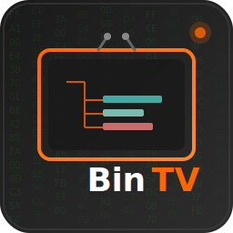
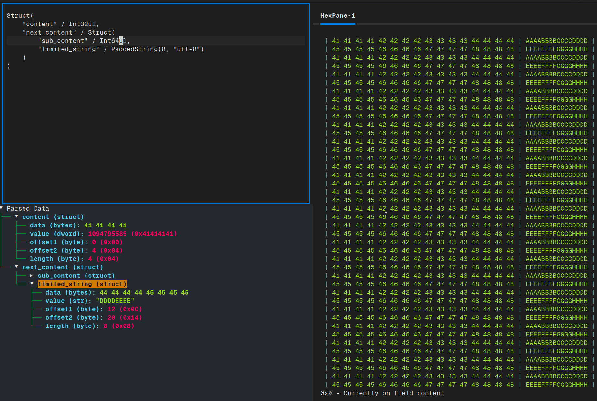

## Binteractiview - Binary Format Visualization Tool

<div align="center">
    
</div>

<p></p>

<p align="center">
  
  
  
</p>

Binteractiview is a terminal-based binary file viewer and analyzer that combines hex editing capabilities with dynamic structure parsing using Python's `construct` library. It provides real-time visualization of binary data structures with beautiful SVG exports.

## ✨ Features

- **Interactive Hex Viewer**: Navigate and inspect binary files with a responsive hex dump interface
- **Dynamic Structure Parsing**: Define and apply binary structures using `construct` syntax in real-time
- **Multi-File Support**: Work with multiple binary files simultaneously using tabs
- **Offset Tracking**: Automatic offset calculation and display for all parsed fields
- **SVG Visualization**: Export beautiful, dark-themed visualizations of your binary structures
- **Log Panel**: Built-in logging system (toggle with `Ctrl+L`)
- **File Browser**: Integrated file tree for easy file selection

## 📸 Screenshots

### Main Interface
The main interface shows the construct editor on the left, hex view in the center, and structure tree on the right:

<div align="center">
  <kbd>
    
  </kbd>
</div>

### SVG Export
The tool generates professional binary format documentation:

<div align="center">
  <kbd>
    
  </kbd>
</div>

## 🚀 Installation

### Prerequisites
- Python 3.8 or higher
- pip package manager

### Install from source

```bash
# Clone the repository
git clone https://github.com/yourusername/bintv.git
cd bintv

# Create a virtual environment
python -m venv venv
source venv/bin/activate  # On Windows: venv\Scripts\activate

# Install dependencies
pip install .
```

### Dependencies

```txt
textual
construct
rich
```

## 📖 Usage

### Basic Usage

```bash
# Launch BinTV
bintv

# Open with a specific file
bintv -t path/to/binary/file.bin
```

### Keyboard Shortcuts

| Key | Action |
|-----|--------|
| `Ctrl+O` | Open file browser |
| `Ctrl+L` | Toggle log panel |
| `Ctrl+T` | Align multiple files |
| `Ctrl+Q` | Quit application |
| `Arrow Keys` | Navigate hex view |
| `Tab` | Switch between panes |

### Defining Binary Structures

Use the construct editor to define your binary format:

```python
# Example: PNG file structure
Struct(
    "signature" / Bytes(8),
    "chunks" / GreedyRange(
        Struct(
            "length" / Int32ub,
            "type" / Bytes(4),
            "data" / Bytes(this.length),
            "crc" / Int32ub
        )
    )
)
```

The structure will be applied in real-time to the loaded binary file.

### Working with RawCopy

BinTV automatically wraps fields with `RawCopy` to track offsets:

```python
# Your input:
Struct("field" / Int32ul)

# BinTV processes as:
Struct("field" / RawCopy(Int32ul))
```

This provides offset information for visualization and navigation.

## 🎨 Visualization Export

BinTV can export your binary analysis as beautiful SVG diagrams:

```python
from bintv.visualization import create_gif_style_svg

# After parsing your binary file
svg_content = create_svg(
    flattened_data,
    raw_data,
    title="MY FILE FORMAT"
)

# Save to file
with open("visualization.svg", "w") as f:
    f.write(svg_content)
```

### Visualization Features

- **Dark theme** with syntax highlighting
- **Color-coded fields** matching hex dump to structure
- **Automatic layout** with connected field descriptions
- **Responsive design** that adapts to content

## 🏗️ Architecture

```
bintv/
├── __main__.py          # Entry point
├── app.py               # Main Textual application
├── widgets/
│   ├── hex_view.py      # Hex dump widget
│   ├── reactive_construct_tree.py  # Structure tree widget
│   └── log_panel.py     # Logging widget
└── svg_exporter.py     # SVG generation
```

## 🤝 Contributing

Contributions are welcome! Please feel free to submit a Pull Request. For major changes, please open an issue first to discuss what you would like to change.

1. Fork the repository
2. Create your feature branch (`git checkout -b feature/AmazingFeature`)
3. Commit your changes (`git commit -m 'Add some AmazingFeature'`)
4. Push to the branch (`git push origin feature/AmazingFeature`)
5. Open a Pull Request

## 📝 License

This project is licensed under the MIT License - see the [LICENSE](LICENSE) file for details.

## 🙏 Acknowledgments

- [Textual](https://github.com/Textualize/textual) - Amazing TUI framework
- [Construct](https://github.com/construct/construct) - Powerful binary parsing library
- [Rich](https://github.com/Textualize/rich) - Beautiful terminal formatting

## 📮 Contact

- GitHub: [@tomerfry](https://github.com/tomerfry)

---

<p align="center">Made with ❤️ for the binary analysis community</p>
